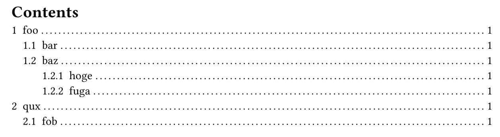
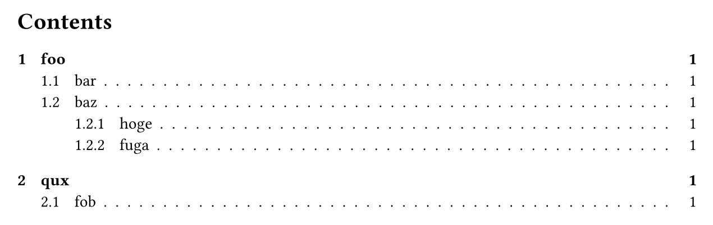

# LaTeX styles for Typst

```bash
# Init new example document based on latex-style template.
typst init @local/latex-style
```

## Outline

```typst
// Style outline as LaTeX "Table of contents".
#show: latex-style.style_outline
```

Before (default Typst style):


After (with `latex-style.style_outline` applied):


# Local development

Make package available to Typst under `@local/latex-style:0.1.0`.
```bash
mkdir -p ~/.local/share/typst/packages/local/latex-style
ln -s "$(realpath latex-style-typ)"  ~/.local/share/typst/packages/local/latex-style/0.1.0
```
